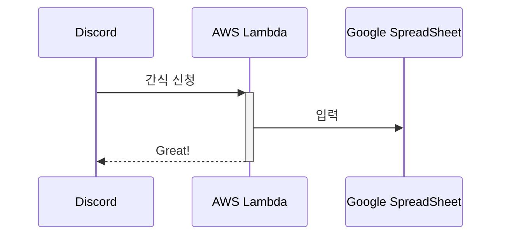

# 헨젤 봇

간식 신청을 편리하게!

## 요구사항

- `/snack` 이라는 명령을 통해 파라미터를 입력받아서 구글 스프레드시트 업데이트
- `/status` 명령을 통해 현재 신청된 간식 목록 가져오기
- Optional. 즐겨찾는 간식 목록 제공
- ~~매달 정해진 날짜에 공지 채널을 통해 멤버들에게 알림 주기~~ 주문 시점이 유동적인 것 같아서 취소
- Message 는 2000자 이하로 제한

## 개략적 설계

- 월간 사용자 30 남짓
- API 요청이 많지 않을 것

discord 명령어 `/신청` 을 통해 간식 링크 및 description 을 구글 스프레드시트에 삽입해주는 API

| 날짜       | 이름   | 품명   | 링크 | 구매여부 |
| ---------- | ------ | ------ | ---- | -------- |
| 2023-05-21 | 송경근 | 꼬북칩 |      | 대기 중  |
| 2023-05-21 | 송경근 | 콘칩 |      | 대기 중  |

[[AWS Lambda]] 를 사용하면 별도의 서버 없이도 간식 API 를 제공 가능

자주 실행될 API 가 아니기 때문에 서버를 24시간 유지할 필요가 없다. 또한 예상되는 API call 수는 Lambda 의 무료 범위를 한참 밑도므로 비용 없이 API 를 호출할 수 있다.

## 구현할 내용

- `/announce` 명령을 사용하여 멤버들에게 정해진 템플릿을 공지
    - 관리자 권한이 있는 멤버만 `/announce` 호출 가능

- google SpreadSheet 에 접근하려면 GCP 프로젝트가 필요하고 API 사용 활성화 및 서비스 계정을 생성해줘야 한다.
- 

## Reference

- [Interact with Google Sheets from Java](https://www.baeldung.com/google-sheets-java-client)