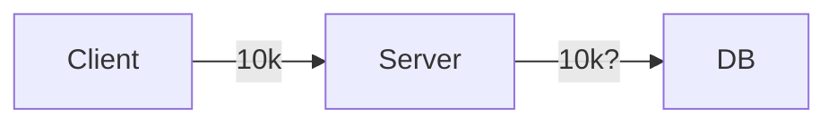

TOC

- [[PostgreSQL]] 을 기반으로 실험
- DB Connection 기본 설정으로 살펴보기
- 네트워크 에러가 어떻게 핸들링되는지 살펴보기
- [[Virtual Thread]] 를 적용하고 테스트해보기
- 메세지 큐를 도입하여 데이터베이스 커넥션의 한계를 넘어보자

## 사전 조사

- 20k 정도에서 커넥션이 실패했던 문제는, 서버가 아니라 클라이언트의 문제일 수 있다.[^1]

> 만일 서버 투 서버로 1:1 대용량 접속이 발생할 경우 한 대의 클라이언트에서 가능한 최대 요청 수는 500 RPS(Requests Per Second) 정도다. 500 * 60 (TIME_WAIT 시간) = 3만개 이기 때문이다. 이 수치를 넘어서지 않는다면 아무런 커널 설정도 변경할 필요가 없으며, 부하 테스트 등 특수한 용도여야 이 수치를 넘어설 수 있을 것이다.

- 요즘은 scale-out 을 통해 쉽게 트래픽 대응이 가능하다. 하지만, 1대의 서버에서 최대한의 효율을 끌어낼 수 있다면 비용 측면에서 가치가 없진 않을 것이다.

---

[[Spring MVC Traffic Testing|Spring MVC 트래픽 테스트]] 글에서 최소한의 설정 수정으로 얼마나 트래픽을 견딜 수 있을지 확인해봤었다. 이번 글에서는 조금 더 현실에 가까운 조건을 걸어보려 한다.

DB 커넥션이다.

핵심 비즈니스와 관련된 API 요청은 트랜잭션을 유발한다. 선착순 예약 시스템을 생각해보자. 매우 많은 수의 요청이 순식간에 발생하고 허용된 수만큼은 트랜잭션을 시작하게 될 것이다. 모든 요청이 트랜잭션을 시작하게 되면 DB 는 순식간에 죽어버릴 것이다. 일종의 쓰로틀링이 필요하다.

많은 수의 요청은 필연적으로 동시성 문제를 야기한다.

더 좋은 예시가 없나...

## Reference

- https://docs.likejazz.com/time-wait/

[^1]: https://docs.likejazz.com/time-wait/