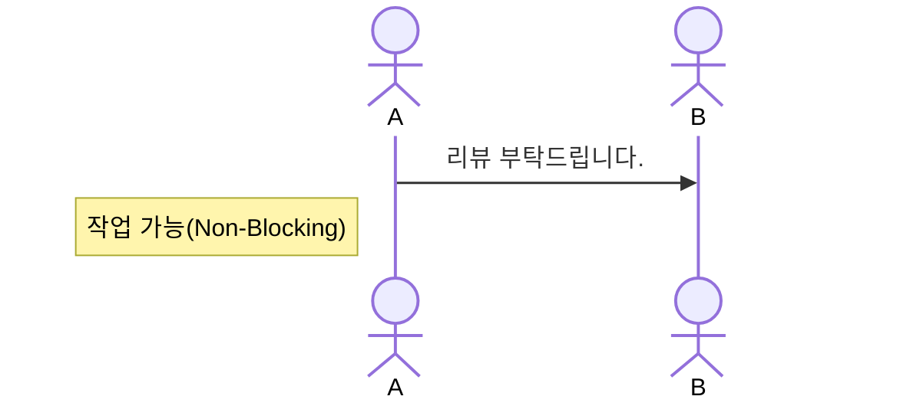
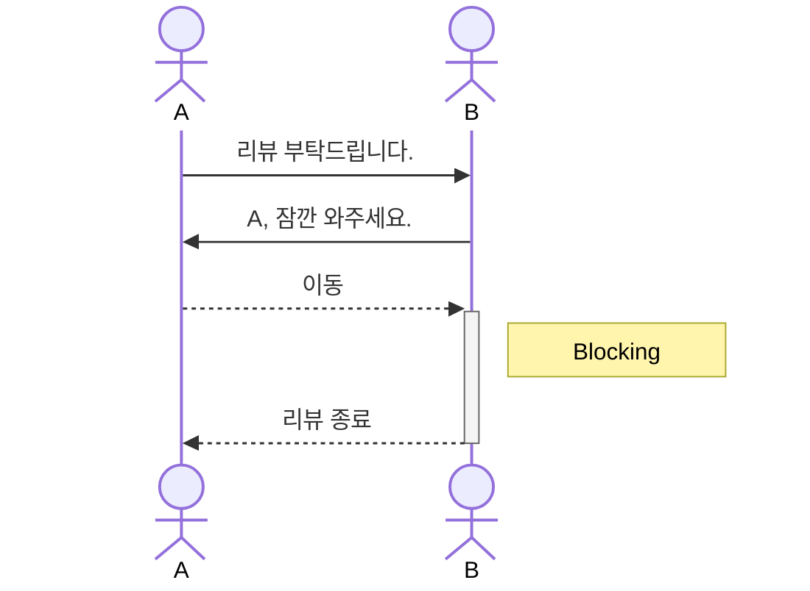
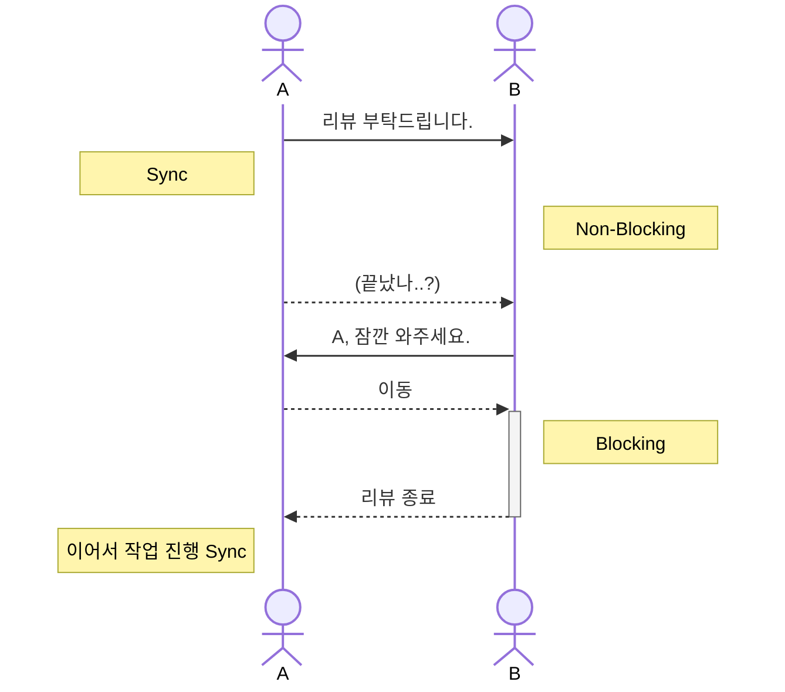

동기 비동기와 블록킹 논블로킹은 유사하면서 다르다. 핵심 키워드는 **제어권**과 **결과에 대한 관심**이다.

## Sync and Async

먼저 동기와 비동기는 프로그래밍의 실행에 대한 결과가 다음 행동에 영향을 주는지에 대한 여부로 구분한다.

```
A()
B()
```

함수 `B()` 가 `A()` 의 결과를 기다려야한다면 이 코드는 동기 코드가 된다. 만약 `B()` 가 `A()` 의 실행 결과에 관심이 없다면 비동기 코드이다.

## Blocking and Non-blocking

블로킹과 논블로킹은 프로그램의 제어권이 어디에 있는지 여부로 구분한다.

 ```
A()
B()
```

`A()` 가 실행되면 제어권은 `A()` 함수 내부로 넘어간다. `A()` 함수가 종료되면 제어권이 반환되고 다시 `B()` 함수를 호출하면서 제어권을 넘겨준다. `B()` 함수는 실행할 제어권이 없기 때문에 `A()` 함수가 제어권을 반환할 때까지 기다려야 한다. 이것을 블로킹이라 한다.

논블로킹에서는 `A()` 가 호출되고 제어권을 거의 즉시 반환받는다. 따라서 `B()` 함수도 바로 실행될 수 있다.

## Example

주니어 개발자(A)가 PR 을 생성하여 시니어 개발자(B)에게 리뷰를 요청한 상황을 가정해보자.



A 는 PR 을 생성했으니 이제 다른 이슈를 작업할 수 있게 되었다(Non-blocking). 그런데 B 시니어가 코드를 살펴보다가 맘에 안드는 부분이 있었는지 A 주니어를 호출하여 옆에 앉게 했다. A 주니어는 하려던 작업이 중단되었다(blocking).



A 는 PR 을 생성했지만 다음 이슈를 처리하기 위해서는 이 PR 이 먼저 병합되어야 했다. 마침 B 시니어가 호출하기도 했으니 자리를 옮겼다(blocking). 곧 리뷰가 끝나고 A 는 원래 자리로 돌아가 작업을 이어 시작한다(Sync)



만약 시니어가 주니어를 호출할 필요가 없고, 주니어에게도 리뷰의 결과가 중요하지 않다면 Non-Blocking Async 임을 쉽게 이해할 수 있을 것 같다.

## Conclusion

동기-비동기, 블로킹-논블로킹은 결국 일련의 프로세스가 어떤 관점에 의해 제어되는지에 따라 정해진다.

## Reference

- https://limdongjin.github.io/concepts/blocking-non-blocking-io.html#ibm-%E1%84%8B%E1%85%A1%E1%84%90%E1%85%B5%E1%84%8F%E1%85%B3%E1%86%AF
