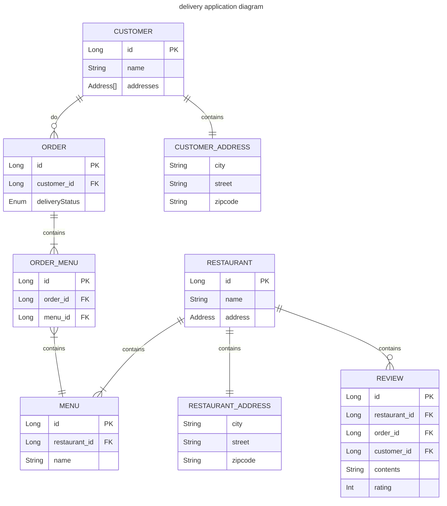

## Overview

JPA 학습 및 Kotlin 에 익숙해지기 위한 샘플 애플리케이션

## Skill

- [[Kotlin]]
- [[Spring Data JPA]]
- [[MySQL]]
- [[Kotest]]

## ERD

- Review
- Customer
- Restaurant
- **Order**
- Menu

## Request

### Customer

- [x] 회원가입이 가능하다.
    - [x] 회원가입시에는 이름을 입력해야 한다.
    - [x] 회원가입시에는 주소를 입력해야 한다.
    - [x] 회원가입시에는 전화번호를 입력해야 한다.
- [ ] Spring Data Envers 를 적용하여 History 관리

### Order

- [x] 사용자는 주문을 생성할 수 있다.
    - 주문을 생성한 사용자는 **주문당 하나의 리뷰를 작성**할 수 있다.
    - 사용자는 **한 번에 하나의 식당에만 주문**할 수 있다.
    - [x] 한 번의 주문에 여러 메뉴를 담을 수 있다.
- (Optional) 배달이 완료되기 전에는 다른 주문을 할 수 없다.

### Restaurant & Menu

식당과 메뉴는 이미 등록되어 있다.

- 메뉴 페이징 처리

### (Optional) Security

#### Owner

- 회원가입이 가능하다.
    - 회원가입시에는 이름을 입력해야 한다.
    - 회원가입시에는 가게명(상호)를 입력해야 한다.
    - 회원가입시에는 전화번호를 입력해야 한다.

#### Restaurant

- Owner 만 식당을 등록할 수 있다.

#### Menu

- 식당을 등록한 Owner 만 Menu 를 등록할 수 있다.

#### Rider

- 라이더는 주문의 상태를 변경할 수 있다.

## Question

- [?] GenerateValue
    - 0 으로 초기화해놓고 사용 가능한가?
- [?] 주문은 Order 를 통해서 생성되어야 할까? 아니면 OrderMenu 를 통해서 생성되어야 할까?
    - `CreateOrderController` 에서 요청을 받고, `CreateOrderUsecase` 에게 생성을 위임한다.
- [?] Review 는 어느 도메인과 연관관계를 맺어야 할까?
    - [x] 조회 관점에서 볼 때 Restaurant 에서 접근할 가능성이 높으므로 Restaurant 과 연관관계를 형성한다.
- [?] 한 번의 Order 에 5개의 menu 가 포함되어 있다면, OrderMenu 를 5번 insert 해야할까?
    - [x] 처음 Order 를 생성하고 바로 save 를 해야 orderMenu 를 정상적으로 save 할 수 있으며, Menu 개수마다 insert 를 생성한다.
- [?] `CreateOrderController` 와 `CreateReviewController` 를 보면 맡은 역할의 범위가 다르다. order 는 컨트롤러에서 usecase 를 호출하여 데이터를 설정해주지만, review 에서는 usecase 에서 repository 를 호출하여 데이터를 생성한다. 둘 중 어느 방식이 더 권장될까?
- [ ] Paging
- [x] GenerateValue
    - 0 으로 초기화되어 있으면 trasient save before flush 등의 error 가 발생하여, null 로 초기화해야 한다.
    - 실제 db 에 save 쿼리가 발생해야 하는데, 영속성 컨텍스트에 이미 있다고 판단하고 save 쿼리가 발생하지 않고 자식 객체의 save 가 호출될 때, 부모의 외래키를 찾을 수 없기 때문이다.
- [ ] Lazy Loading
- [ ] 양방향 매핑 시 발생하는 순환참조 문제
    - [ ] Menu Entity 에서 Repository 를 완전히 제거하고, 양방향 매핑이더라도 한쪽으로만 흐르게 변경한다.
    - [ ] 모든 조회는 루트 애그리거트인 Restaurant 에서만 가능하다.
- [ ] Restaurant 을 저장할 때 Menu 에 Restaurant 의 id 가 설정되지 않는 문제
- [ ] 단순 검증 로직이 Adapter 에 있어도 되는지에 대한 고민

- [ ] Hexagonal 아키텍처에서 JPA 의 사용은 영 불편한 감이 있다.
    - [ ] 더티 체킹의 존재 자체가 불변성을 위반한다.

- 고객은 여러 주소를 가질 수 있다.
- Restaurant 은 하나의 주소만 가질 수 있다.
- 그렇다면 주소는 어느 애그리거트에 속해야할까?
    - 주소 둘을 서로 엔티티 분리, CUSTOMER_ADDRESS, RESTAURANT_ADDRESS

envers
jib