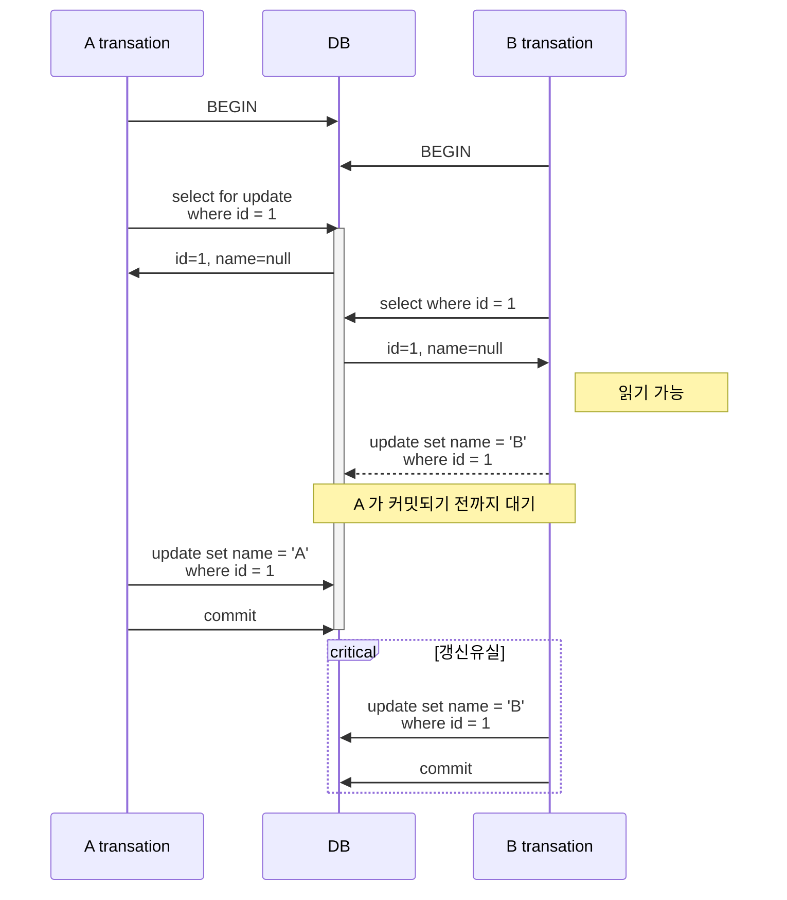
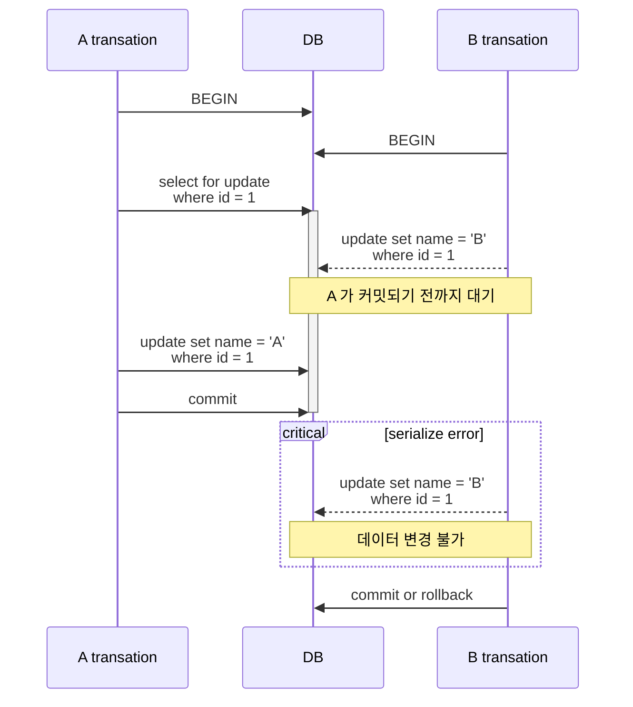
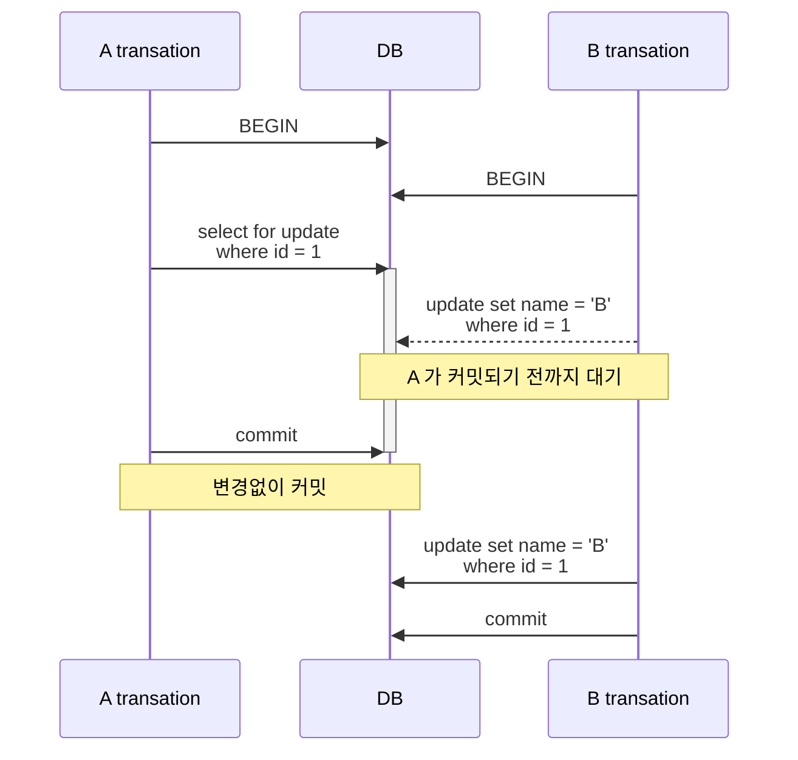
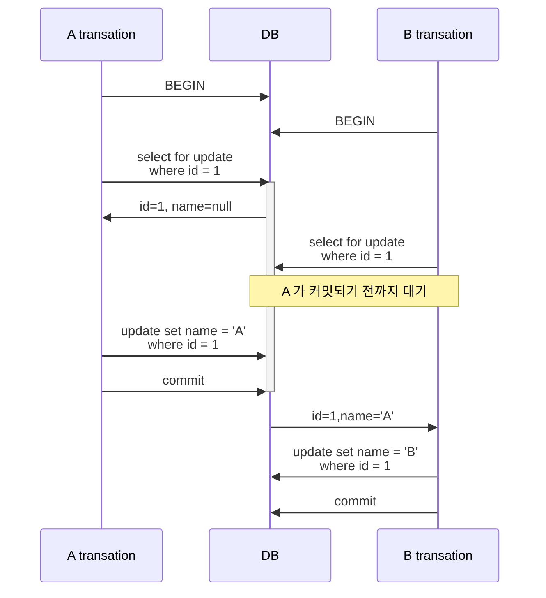

## SELECT FOR UPDATE 구문의 동작 방식

`select for update` 는 티켓 예매 등, 특정 고객이 티켓 예매 과정을 진행하는 동안 다른 고객이 데이터를 변경할 수 없도록 막기 위해 사용할 수 있어요.

[[PostgreSQL]] 에서 `select for update` 구문은 **트랜잭션 격리레벨에 따라서 다르게 동작**합니다. 따라서 격리레벨 별로 살펴봐야 해요.

아래와 같은 데이터가 존재할 때 데이터를 변경하는 상황을 가정해볼게요.

| id  | name |
| --- | ---- |
| 1   | null |

## 1. Read committed

- [[PostgreSQL]] 의 기본 격리레벨
- A 트랜잭션이 `select for update` 로 행을 잠그더라도 B 트랜잭션에서 데이터를 읽을 수 있다.
- A 트랜잭션이 커밋하기 전까지는 B 트랜잭션에서 데이터를 변경할 수 없다.
- B 트랜잭션이 A 트랜잭션이 커밋되길 기다리고 있을 경우, A 트랜잭션이 커밋되면 B 트랜잭션이 곧바로 커밋된다.
- **갱신 유실이 발생**한다.

Exclusive Lock 이 적용된 부분은 진한 색으로 표시했어요. 위 다이어그램에서 볼 수 있듯이, [[PostgreSQL]] 은 잠금없는 읽기를 막지 않아요. 대신 A 트랜잭션에서 잠금을 획득한 레코드에 대해서 B 트랜잭션이 변경하려고 시도하면 A 트랜잭션이 완료될 때까지 기다리게 되어요. 결국 **갱신 유실을 피할 수 없게 됩니다**.

만약 갱신 유실을 방지해야한다면 Repeatable Read 격리 레벨을 사용해야 해요.

## 2. Repeatable Read

- A 트랜잭션이 `select for update` 로 행을 잠그더라도 B 트랜잭션에서 데이터를 읽을 수 있다.
- A 트랜잭션이 커밋하기 전까지는 B 트랜잭션에서 데이터를 변경할 수 없다.
- B 트랜잭션에서 데이터를 변경하려고 하면 **직렬화 오류가 발생**한다. (B 트랜잭션 rollback 조치 필요)
- **갱신 유실이 발생하지 않는다.**

### 트랜잭션간 데이터 변경 작업이 충돌하는 경우

동시 변경 작업이 감지되어 직렬화 오류가 발생하는 것을 확인할 수 있어요. 이럴 경우, 개발자가 직접 에러 핸들링을 해줘야 합니다.

### 트랜잭션간 데이터 변경 작업이 충돌하지 않는 경우

만약 A 트랜잭션에서 A 아이디에 해당하는 row 를 잠궜지만 변경하지 않았고, B 트랜잭션에서는 변경했다고 할 때 이 경우 트랜잭션이 충돌할까?

[[PostgreSQL]] 에서는 상호 잠금이 충돌하지 않는 경우는 모든 변경사항이 반영됩니다.

A 트랜잭션이 commit 된 시점에 충돌하는 데이터 변경사항이 없기 때문에 B 트랜잭션의 변경사항이 에러없이 반영되게 되어요.

## 3. Serializable

- Repeatable Read 와 동일합니다.

## A, B 모두 SELECT FOR UPDATE 를 호출하는 경우

그렇다면 양 쪽 트랜잭션에서 모두 `select for update` 를 호출한다면 어떻게 될까요?

이렇게 될 경우는 **격리레벨과는 상관없이** 서로 Exclusive Lock 을 획득해야하기 때문에 **한 쪽에서 lock 을 해제해야 다른 트랜잭션이 lock 을 획득**할 수 있습니다.

모든 작업을 순차적으로 처리하도록 보장하고 싶다면 모든 트랜잭션이 `select for update` 를 사용하여 lock 을 획득할 수 있도록 해야 합니다.

## Conclusion

지금까지 살펴본 부분들을 정리해볼게요.

- `select for update` 구문에서 잠금없는 읽기 동작을 막지 않아요.
- 모든 읽기를 막는 것이 아닌 잠금 기반으로 제어함으로써 성능을 최대한 높일 수 있어요.
- 잠금으로 동시성을 제어하고자 한다면 모든 트랜잭션에서 `select for update` 를 사용해야 해요.

[[PostgreSQL]] 의 select for update 구문은 **모든 격리 수준에서 잠금없는 읽기를 방해하지 않아요.** 대신 커밋 시점에서 데이터의 변경이 감지되면 그 때 에러를 발생시켜서 추가적인 동작을 유도합니다. 또한 잠금이라고 해서 항상 다른 트랜잭션을 기다려야하는 것도 아니에요. 상황에 맞게 처리하면서 성능을 최대한 발휘하도록 설계되어 있는 점이 재밌는 점이네요.

## Reference

- https://dev.to/mahmoudhossam917/postgresql-locks-part-3-3481#:~:text=The%20FOR%20SHARE%20lock%20mode%20in%20PostgreSQL,ensuring%20data%20consistency%20without%20blocking%20other%20readers.
