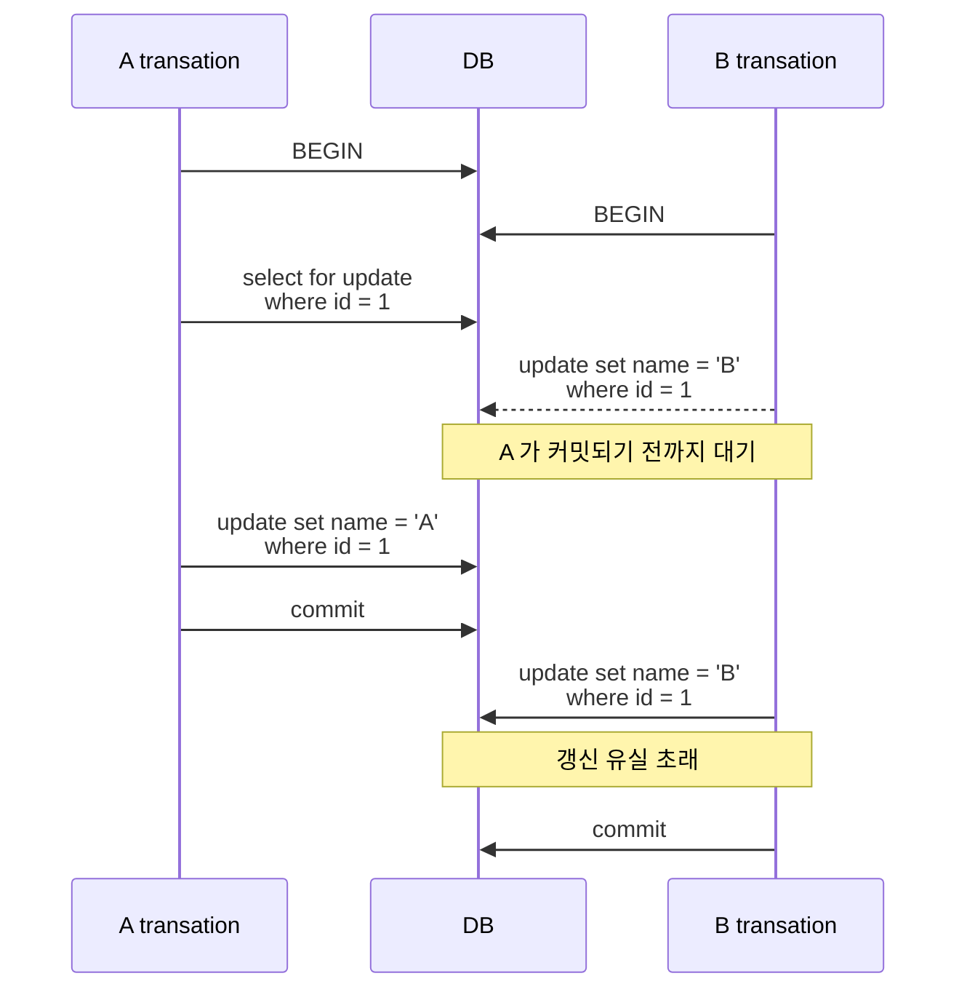
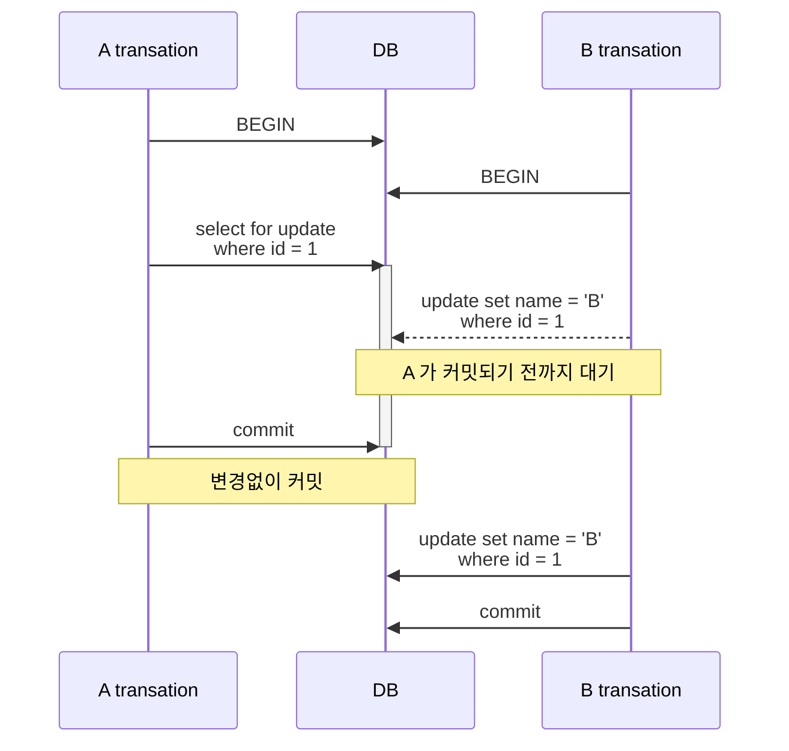

많은 글에서 select for update 는 다른 트랜잭션에서 데이터를 읽지 못하고 대기해야한다고 설명되어 있다. 우리나라는 아무래도 [[MySQL]] 점유율이 높은 편이다보니 MySQL 에 맞춰 설명되어 있는 것 같다. 그렇다면 [[PostgreSQL]] 은 어떨까?

## Select For Update 구문의 동작 방식

[[PostgreSQL]] 에서 select for update 구문은 트랜잭션 격리레벨에 따라서 다르게 동작한다.

## 1. Read commited

- [[PostgreSQL]] 의 기본 격리레벨. 1번 트랜잭션이 select for update 로 행을 잠그더라도 2번 트랜잭션에서 데이터를 읽을 수 있다.
- 1번 트랜잭션이 커밋하기 전까지는 2번 트랜잭션에서 데이터를 변경할 수 없다.
- 2번 트랜잭션이 1번 트랜잭션이 커밋되길 기다리고 있을 경우, 1번 트랜잭션이 커밋되면 2번 트랜잭션이 곧바로 커밋된다.
- **갱신 유실이 발생**한다.

## 2. Repeatable Read

- 1번 트랜잭션이 select for update 로 행을 잠그더라도 2번 트랜잭션에서 데이터를 읽을 수 있다.
- 1번 트랜잭션이 커밋하기 전까지는 2번 트랜잭션에서 데이터를 변경할 수 없다.
- 2번 트랜잭션에서 데이터를 변경하려고 하면 **직렬화 오류가 발생**한다. (2번 트랜잭션 rollback 조치 필요)
- 갱신 유실이 발생하지 않는다.

### 트랜잭션간 데이터 변경 작업이 충돌하는 경우

### 트랜잭션간 데이터 변경 작업이 충돌하지 않는 경우

만약 A 트랜잭션에서 1번 아이디에 해당하는 row 를 잠궜지만 변경하지 않았고, B 트랜잭션에서는 변경했다고 할 때 이 경우 트랜잭션이 충돌할까?

[[PostgreSQL]] 에서는 상호 잠금이 충돌하지 않는 경우는 모든 변경사항이 반영된다.

## 3. Serializable

- Repeatable Read 와 동일하다.

## Conclusion

[[PostgreSQL]] 의 select for update 구문은 **모든 격리 수준에서 읽기를 방해하지 않는다.** 커밋 시점에서 데이터의 변경이 감지되면 그 때 에러를 발생시켜서 추가적인 동작을 유도한다. 또한 잠금이라고 해서 항상 다른 트랜잭션을 기다려야하는 것도 아니다. 상황에 맞게 처리하면서 성능을 최대한 발휘하도록 설계되어 있는 점이 재밌다.
