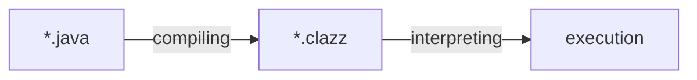

[[Java Hello World Deepdive 1]] 편에 이어서 "Hello World" 를 출력하기 위해 코드가 어떻게 변해가는지 살펴봅니다.

## Chapter 2. Compile 과 Disassemble

프로그래밍 언어에는 레벨이 있다.

프로그래밍 언어가 인간의 언어와 가까울수록 고수준 언어, 컴퓨터가 이해할 수 있는 언어(=기계어)에 가까울수록 저수준 언어라고 한다. 고수준 언어로 프로그램을 작성하면 인간이 이해하기 쉽기에 높은 생산성을 얻을 수 있지만, 그만큼 기계어와의 괴리가 심해지니 이 간극을 메우기 위한 과정이 필요하다.

프로그래밍 언어가 기계어로 변환되는 과정, 이걸 **컴파일(compile)** 이라고 부른다.

[[Java]] 또한 저수준 언어는 아니므로, 컴파일 과정이 존재한다. 자바에서는 이 컴파일 과정이 어떻게 동작하는지 살펴보자.

### Compile

앞서 설명했던 것처럼 Java 코드를 컴퓨터가 읽고 해석할 수 없다. Java 애플리케이션의 실행을 위해서는 코드를 컴퓨터가 읽고 해석할 수 있는 형태로 변환해줘야하는데, 이를 위해 크게는 아래와 같은 과정을 거치게 된다.



컴파일의 결과물인 `.class` 파일은 바이트 코드로 되어 있다. 하지만 여전히 컴퓨터가 실행할 수 있는 기계어는 아닌데, JVM 이 이 바이트 코드를 읽어서 기계어로 변환하는 작업을 마저 처리해준다. JVM 이 어떻게 처리해주는지는 마지막 챕터에서 다룬다.

우선, `.java` 파일을 컴파일해서 `.class` 파일을 만들어보자. `javac` 명령어를 사용하면 컴파일할 수 있다.

```java
// VerboseLanguage.java
public class VerboseLanguage {
    public static void main(String[] args) {
        System.out.println("Hello World");
    }
}
```

```bash
$ javac VerboseLanguage.java
```


클래스 파일이 생성된 것을 확인할 수 있다. `java` 명령어를 사용해서 클래스 파일을 실행시킬 수 있으며, 여기까지가 자바로 작성한 프로그램을 실행시키는 기본 흐름이다.

```bash
$ java VerboseLanguage
// Hello World
```

class 파일이 어떤 내용으로 이루어졌는지 궁금하지 않은가? 도대체 컴퓨터는 어떻게 생긴 언어를 읽고 실행하는지 신경쓰이지는 않는가? 이 파일에는 무슨 비밀이 들어있을까? 마치 판도라의 상자 같다.

기대를 안고 열어보면,


_어림도 없지_

바이너리(binary)라는 짤막한 내용만 표시된다.

_아니 지금까지 컴파일의 결과물은 바이트 코드라며...?_

그렇다. 바이트 코드다. 동시에 바이너리 코드이기도 하다. 이쯤에서 바이트 코드와 바이너리 코드의 차이점을 간략하게 짚어보고 넘어가자.

- 바이너리 코드: 0과 1 로만 구성된 코드. 기계어는 바이너리 코드로 이루어져 있지만, 모든 바이너리 코드가 기계어인 것은 아니다.
- 바이트 코드: 0과 1 로만 구성된 코드. 하지만 바이트 코드는 기계(machine)을 위한 것이 아닌 **VM 을 위한 것**이다. VM 에서 [[JIT compiler]] 등을 통해 기계어로 변환된다.

그래도 나름 이 글의 주제가 Deep-dive 를 표방하고 있는만큼 꾸역꾸역 변환하여 읽어봤다.


_다행히 우리들의 판도라의 상자 안에는 0 과 1 이 들어있을 뿐, 별 다른 고난이나 역경은 들어있지 않다._

읽어내는데는 성공했지만, 이 결과만 가지고는 도저히 내용을 알기 어렵다. 뭔가 추가적인 작업이 필요할 것 같다.

### Disassemble

컴파일 과정을 진행하면 0과 1로 구성된 바이트 코드로 변환된다. 위에서 살펴봤듯이 바이트 코드를 그대로 해석하기는 무척 어렵다. 다행히도 JDK 에는 개발자가 컴파일된 바이트 코드를 읽을 수 있게 도와주는 도구가 포함되어 있어서 디버깅 등의 목적으로 활용할 수 있다.

바이트 코드를 개발자가 해석하기 편한 형태로 변환하는 과정을 **역어셈블(disassemble)** 이라고 한다. 가끔 이 과정을 역컴파일(decompile)이라고도 하는 것 같은데, `javap` 문서에는 명확하게 disassemble 이라고 표현하고 있으므로 이를 따르도록 하겠다.


> [!info] 역컴파일(decompile)과 역어셈블(disassemble)의 차이
> 역컴파일의 경우는 말 그대로 바이트코드를 컴파일 하기 전처럼, 상대적으로 고수준의 언어로 표현하는 것을 말한다. 반면, 역어셈블은 바이트코드를 사람이 읽을 수 있는 특정 형식으로 표현해주는 것을 말한다.

이제 `javap` 를 사용해서 바이트코드를 변환(disassemble)해보자. 0, 1 보다는 훨씬 읽을만한 결과가 출력된다.

```bash
$ javap -c VerboseLanguage.class
```

```
Compiled from "VerboseLanguage.java"
public class VerboseLanguage {
  public VerboseLanguage();
    Code:
       0: aload_0
       1: invokespecial #1                  // Method java/lang/Object."<init>":()V
       4: return

  public static void main(java.lang.String[]);
    Code:
       0: getstatic     #7                  // Field java/lang/System.out:Ljava/io/PrintStream;
       3: ldc           #13                 // String Hello World
       5: invokevirtual #15                 // Method java/io/PrintStream.println:(Ljava/lang/String;)V
       8: return
}
```

이걸 보고 무엇을 알 수 있을까?

먼저, 이 형태는 virtual machine assembly language 라고 불린다.

> The Java Virtual Machine code is written in the informal “virtual machine assembly language” output by Oracle's javap utility, distributed with the JDK release. - JVM Spec

format 은 아래와 같다.

```
<index> <opcode> [ <operand1> [ <operand2>... ]] [<comment>]
```

- index: JVM code 바이트 배열의 인덱스. 메서드 시작 오프셋으로 생각할 수도 있다.
- opcode: 명령어(instruction) 집합 opcode 의 연상 기호(mnemonic). 우리는 무지개의 색상 순서를 빨주노초파남보라는 단어 기억한다. 무지개의 색상이 명령어 집합이라면, 빨주노초파남보는 이를 구별하기 위해 정의된 연상 기호라고 할 수 있다.
- operandN: 명령어의 피연산자. 컴퓨터 명령어의 피연산자는 주소 필드이다. constant pool 에서 처리할 데이터가 저장되어 있는 장소를 가리킨다.

출력된 역어셈블의 결과에서 main 메서드 부분만 좀 더 살펴보자.

```
Code:
   0: getstatic     #7                  // Field java/lang/System.out:Ljava/io/PrintStream;
   3: ldc           #13                 // String Hello World
   5: invokevirtual #15                 // Method java/io/PrintStream.println:(Ljava/lang/String;)V
   8: return
```

- `invokevirtual`: 인스턴스 메서드 호출
- `getstatic`: 클래스에서 static field 를 가져온다
- `ldc` run-time constant pool 에 데이터를 적재한다.

3번째 줄의 `3: ldc #13` 은 13번 인덱스에 아이템을 넣으라는 의미이며, 넣는 아이템이 무엇인지는 주석으로 친절하게 표시되어 있다.

_Hello World_

참고로 getstatic, invokevirtual 같은 바이트 코드 명령어 opcode 들은 1바이트의 바이트 번호로 표현된다. getstatic=0xb2, invokevirtual = 0xb6 등이다. 1바이트는 256가지 종류의 수를 표현할 수 있으므로, 자바 바이트코드 명령어 opcode 역시 최대 256개라는 점을 알 수 있다.


_JVM Instruction Set 에 명시된 invokevirtual 의 바이트 코드_

main method 의 바이트 코드만 hex 로 보면 다음과 같다.

```
b2 00 07 12 0d b6
```

아직은 눈치채기 어려울 수도 있을 것 같다. 힌트를 주자면, 좀 전에 opcode 앞의 숫자는 JVM array 의 index 라고 했었다. 표현 방식을 살짝 바꿔보자.

```
arr = [b2, 00, 07, 12, 0d, b6]
```

- arr[0] = b2 = getstatic
- arr[3] = 12 = ldc
- arr[5] = b6 = invokevirtual

getstatic 은 2바이트의 피연산자가 필요하고, ldc 는 1바이트의 피연산자가 필요하다. 따라서 0번째에 있는 getstatic 다음 명령어인 ldc 는 1, 2 를 건너뛴 3번째에 기록된다.

`-verbose` 옵션을 주면 constant pool 을 포함한 역어셈블 결과를 볼 수 있다. operand 와 constant pool 을 함께 살펴보는 것도 재밌을 것이다.

```
  Compiled from "VerboseLanguage.java"
public class VerboseLanguage
  minor version: 0
  major version: 65
  flags: (0x0021) ACC_PUBLIC, ACC_SUPER
  this_class: #21                         // VerboseLanguage
  super_class: #2                         // java/lang/Object
  interfaces: 0, fields: 0, methods: 2, attributes: 1
Constant pool:
   #1 = Methodref          #2.#3          // java/lang/Object."<init>":()V
   #2 = Class              #4             // java/lang/Object
   #3 = NameAndType        #5:#6          // "<init>":()V
   #4 = Utf8               java/lang/Object
   #5 = Utf8               <init>
   #6 = Utf8               ()V
   #7 = Fieldref           #8.#9          // java/lang/System.out:Ljava/io/PrintStream;
   #8 = Class              #10            // java/lang/System
   #9 = NameAndType        #11:#12        // out:Ljava/io/PrintStream;
  #10 = Utf8               java/lang/System
  #11 = Utf8               out
  #12 = Utf8               Ljava/io/PrintStream;
  #13 = String             #14            // Hello World
  #14 = Utf8               Hello World
  #15 = Methodref          #16.#17        // java/io/PrintStream.println:(Ljava/lang/String;)V
  #16 = Class              #18            // java/io/PrintStream
  #17 = NameAndType        #19:#20        // println:(Ljava/lang/String;)V
  #18 = Utf8               java/io/PrintStream
  #19 = Utf8               println
  #20 = Utf8               (Ljava/lang/String;)V
  #21 = Class              #22            // VerboseLanguage
  #22 = Utf8               VerboseLanguage
  #23 = Utf8               Code
  #24 = Utf8               LineNumberTable
  #25 = Utf8               main
  #26 = Utf8               ([Ljava/lang/String;)V
  #27 = Utf8               SourceFile
  #28 = Utf8               VerboseLanguage.java
{
  public VerboseLanguage();
    descriptor: ()V
    flags: (0x0001) ACC_PUBLIC
    Code:
      stack=1, locals=1, args_size=1
         0: aload_0
         1: invokespecial #1                  // Method java/lang/Object."<init>":()V
         4: return
      LineNumberTable:
        line 1: 0

  public static void main(java.lang.String[]);
    descriptor: ([Ljava/lang/String;)V
    flags: (0x0009) ACC_PUBLIC, ACC_STATIC
    Code:
      stack=2, locals=1, args_size=1
         0: getstatic     #7                  // Field java/lang/System.out:Ljava/io/PrintStream;
         3: ldc           #13                 // String Hello World
         5: invokevirtual #15                 // Method java/io/PrintStream.println:(Ljava/lang/String;)V
         8: return
      LineNumberTable:
        line 3: 0
        line 4: 8
}
SourceFile: "VerboseLanguage.java"
```

## Conclusion

전 챕터에서는 간단하게 Hello World 를 출력하기 위한 클래스 구조에 대해 의문점을 살펴봤었다면, 이번 챕터에서는 Hello World 를 출력하기 전 어떤 과정이 있는지 살펴봤다. 다음으로는 드디어 JVM과 함께 Hello World 출력 메서드의 실행(...!) 흐름을 살펴본다.

## Reference

- https://seung-nari.tistory.com/entry/%EC%BB%B4%ED%93%A8%ED%84%B0-%EA%B5%AC%EC%A1%B0-%EB%AA%85%EB%A0%B9%EC%96%B4-%EC%BD%94%EB%93%9C-OP-Code-Mode-Operand
- https://gngsn.tistory.com/252
- https://d2.naver.com/helloworld/1230
