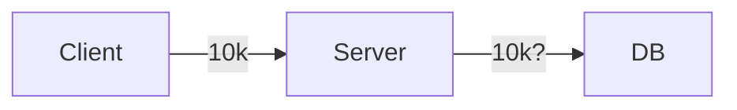

TOC

- [[PostgreSQL]] 을 기반으로 실험
- DB Connection 기본 설정으로 살펴보기
- 네트워크 에러가 어떻게 핸들링되는지 살펴보기
- [[Virtual Thread]] 를 적용하고 테스트해보기
- 메세지 큐를 도입하여 데이터베이스 커넥션의 한계를 넘어보자

[[Spring MVC Traffic Testing|Spring MVC 트래픽 테스트]] 글에서 최소한의 설정 수정으로 얼마나 트래픽을 견딜 수 있을지 확인해봤었다. 이번 글에서는 조금 더 현실에 가까운 조건을 걸어보려 한다.

DB 커넥션이다.

핵심 비즈니스와 관련된 API 요청은 트랜잭션을 유발한다. 선착순 예약 시스템을 생각해보자. 매우 많은 수의 요청이 순식간에 발생하고 허용된 수만큼은 트랜잭션을 시작하게 될 것이다. 모든 요청이 트랜잭션을 시작하게 되면 DB 는 순식간에 죽어버릴 것이다. 일종의 쓰로틀링이 필요하다.

많은 수의 요청은 필연적으로 동시성 문제를 야기한다.

더 좋은 예시가 없나...
