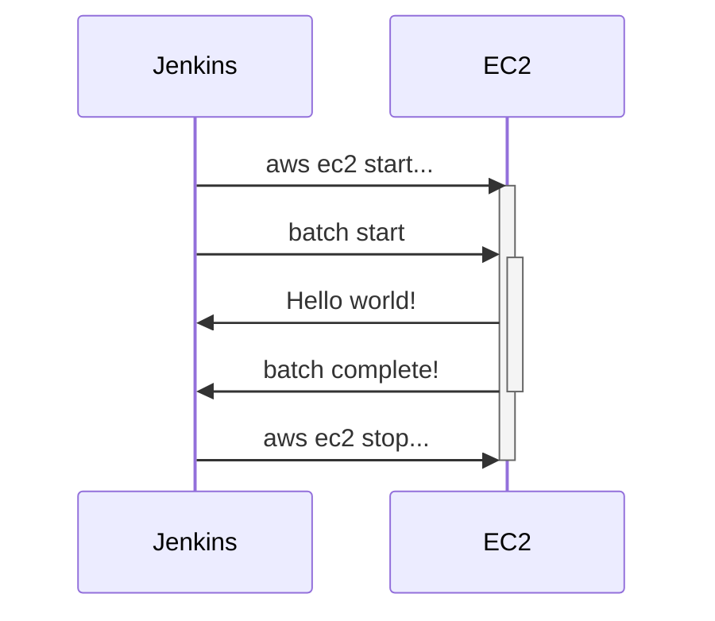

특정 시간, 특정 조건에서만 실행되야하는 배치성 애플리케이션이 존재할 때 리소스 비용을 최적화하는 방법에 대해서 공유합니다.

## Problem

1. 배치는 특정한 시간에만 실행된다. 정산같은 집계 성격의 경우, 1일, 1달, 1년 등 일정 주기로 실행되어야 하는 경우가 대부분이다.
2. 특정 시간에만 필요한 리소스를 위해 24시간 EC2 를 유지해야하는 것은 비효율적이다.
3. 클라우드 서버 리소스가 필요한 순간에만 EC2 를 준비상태로 만들 수 없을까?

물론 가능합니다. [[AWS ECS]], [[AWS EKS]] 등 여러가지 자동화 솔루션들도 있지만, [[Jenkins]] 로 배치 및 EC2 서버를 직접 관리한다고 가정하고 환경을 구성해봅니다.

## Architecture



이러한 구조로 infra 를 설계한다면 24시간 EC2 리소스를 유지할 필요없이 배치가 실행되기 위해 리소스가 필요해질 때만 비용이 청구되도록 할 수 있습니다.

## Jenkins

[[Jenkins]]

### Jenkins node 설정 및 node 관리 정책

요청이 큐에서 대기할 경우에만 node 를 활성화합니다. 불필요한 error 로그가 남는 것을 최소화할 수 있습니다.

## Event driven develop

### AWS CLI 설치

[[AWS CLI]]를 사용하면 terminal 환경에서도 AWS 의 자원을 관리할 수 있습니다.

아래 명령을 사용하여 현재 사용 중인 인스턴스 목록을 가져올 수 있습니다. 자세한 사용법은 AWS 가이드를 참고합니다.

```bash
aws ec2 describe-instances
```

원하는 리소스의 정보를 확인했다면 target 으로 지정하여 특정 동작을 실행하게 할 수 있습니다.

#### EC2 start

```bash
aws ec2 start-instances --instance-ids {instanceId}
```

#### EC2 stop

```bash
aws ec2 stop-instances --instance-ids {instanceId}
```

### Jenkins 에서의 사용

#### scheduling

배치가 한달에 한 번 실행되야 한다고 가정하고 cron 표현식을 작성해줍니다.

```text
H 9 * * *
```

## Conclusion

이번에 작성한 내용은 다소 레거시 환경에서 최대한의 비용 최적화를 시도하기 위해 어떤 방법을 사용할 수 있을지에 대해 적어봤습니다. 최근의 프로젝트들은 ECS 나 k8s 에서 알아서 리소스를 관리해주므로 신경써야할 부분이 적지만, 만약 그런 툴이나 서비스를 사용하지 못하고 오직 Jenkins 만 사용해야한다고 할 때를 가정하고 적은 내용입니다.
