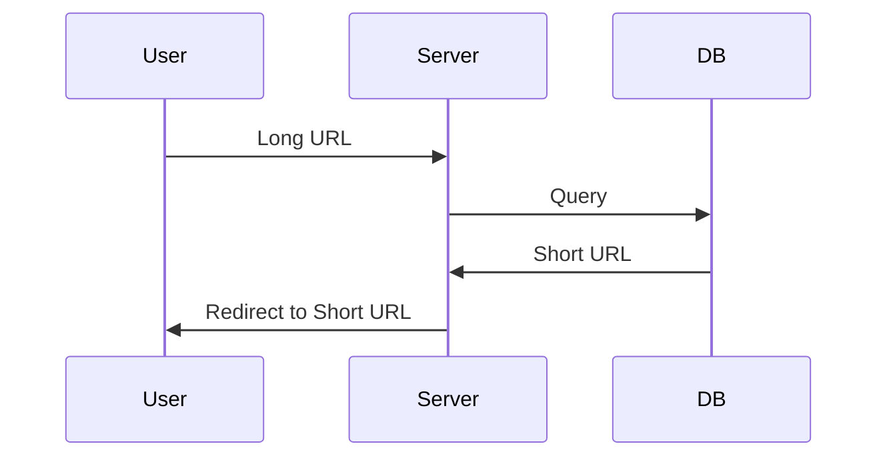
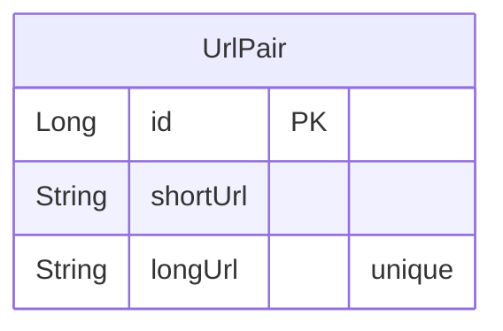

> [!INFO]
> 코드는 [GitHub](https://github.com/songkg7/url-shortener-sample) 에서 확인하실 수 있습니다.

## Overview

url 을 줄이는 것은 이메일 또는 SMS 전송에서 URL 이 단편화되는 것을 방지하기 위해 시작되었습니다. 하지만 요즘에는 트위터나 인스타그램 등 SNS 에서 특정 링크 공유를 위해서 더 활발하게 사용되고 있습니다. 장황하게 보이지 않기 때문에 가독성이 개선되고 URL 로 이동하기 전에 사용자 통계 등 유용한 정보를 수집하는 부가적인 기능을 제공할 수도 있습니다.

## URL 단축기?

바로 결과물부터 보겠습니다.

다음 명령을 통해서 이번 글에서 사용하는 url 단축기를 바로 실행시킬 수 있습니다.

```bash
docker run -d -p 8080:8080 --name tinyurl songkg7/url-shortener
```

## 대략적인 설계

### URL 단축하기



Long URL 을 전달받으면 서버에서 DB 에 해당 URL 이 이미 존재하고 있는지를 질의합니다. 존재한다면 짝을 이루고 있는 Short URL 을 반환하고, 존재하지 않는다면 새로운 Short URL 을 생성하여 DB 에 함께 저장한 뒤 Short URL 을 반환합니다.

URL 정보를 관리하기 위해 `UrlPair` 라는 엔티티를 만들어줍니다.



### 단축된 URL 로 접근

## 구현

지난 번 [[Consistent Hashing|안정 해시]]에서 그랬듯이 직접 구현해볼게요. 다행인 점은 URL 단축 구현은 그렇게 어렵지 않다는 것입니다.

### Model

먼저 유저에게 요청을 받기 위해 모델을 구현합니다. 구조를 최대한 단순화시켜서 단축시킬 URL 만 받았습니다.

```kotlin
data class ShortenRequest(
    val longUrl: String
) {
    private constructor() : this("")
}
```

`POST` 요청을 통해 처리할 수 있도록 Controller 를 구현해줍니다.

```kotlin
@PostMapping("/api/v1/shorten")
fun shorten(@RequestBody request: ShortenRequest): ResponseEntity<ShortenResponse> {
    val url = urlShortenService.shorten(request.longUrl)
    return ResponseEntity.ok(ShortenResponse(url))
}
```

### Base62 Conversion

드디어 가장 핵심적인 부분이네요. URL 을 단축하기 위해 Base62 인코딩을 해줘야 합니다. 인코딩된 URL 이 뭔지 알아야 하므로 디코딩도 구현해줬습니다.

```kotlin
private const val BASE62 = "0123456789abcdefghijklmnopqrstuvwxyzABCDEFGHIJKLMNOPQRSTUVWXYZ"

class Base62Conversion : Conversion {
    override fun encode(input: Long): String {
        val sb = StringBuilder()
        var num = BigInteger.valueOf(input)
        while (num > BigInteger.ZERO) {
            val remainder = num % BigInteger.valueOf(62)
            sb.append(BASE62[remainder.toInt()])
            num /= BigInteger.valueOf(62)
        }
        return sb.reverse().toString()
    }

    override fun decode(input: String): Long {
        var num = BigInteger.ZERO
        for (c in input) {
            num *= BigInteger.valueOf(62)
            num += BigInteger.valueOf(BASE62.indexOf(c).toLong())
        }
        return num.toLong()

    }
}
```

### Test

```bash
curl -X POST --location "http://localhost:8080/api/v1/shorten" \
    -H "Content-Type: application/json" \
    -d "{
            \"longUrl\": \"https://www.google.com/search?q=url+shortener&sourceid=chrome&ie=UTF-8\"
        }"
```

http://localhost:8080/{shortUrl} 로 접근해보면 정상적으로 리다이렉트 되는 것을 확인할 수 있습니다.

## Conclusion

## Reference
