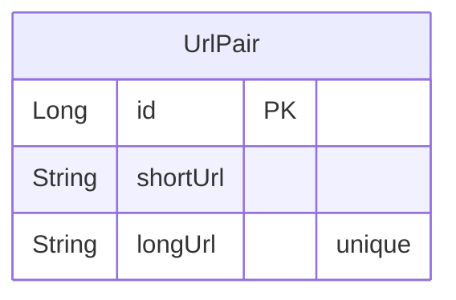
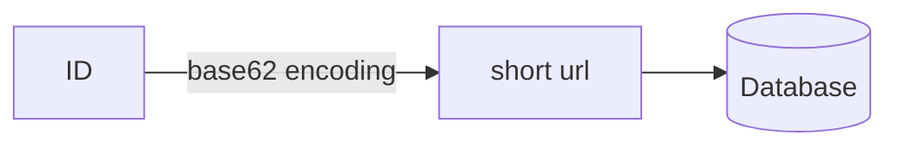
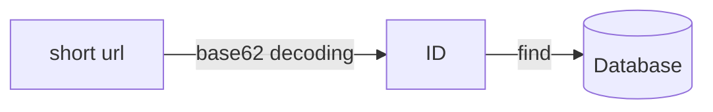
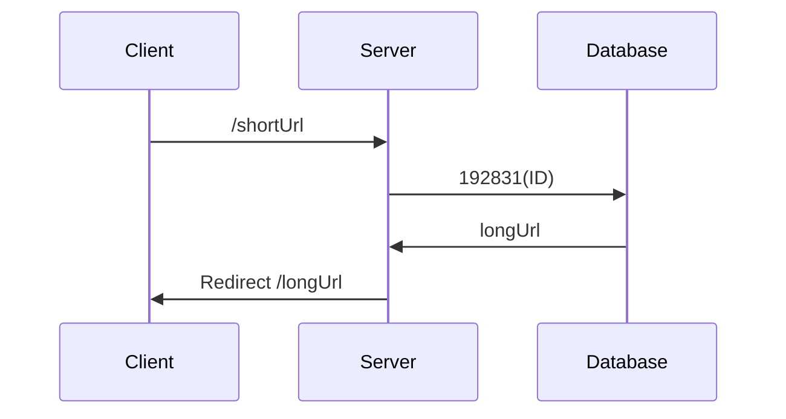

> [!INFO]
> 코드는 [GitHub](https://github.com/songkg7/url-shortener-sample) 에서 확인하실 수 있습니다.

## Overview

URL 길이를 줄이는 것은 이메일 또는 SMS 전송에서 URL 이 단편화되는 것을 방지하기 위해 시작되었습니다. 하지만 요즘에는 트위터나 인스타그램 등 SNS 에서 특정 링크 공유를 위해서 더 활발하게 사용되고 있습니다. 장황하게 보이지 않기 때문에 가독성이 개선되고 URL 로 이동하기 전에 사용자 통계를 수집하는 등 부가적인 기능을 제공할 수도 있습니다.

## URL 단축기?

바로 결과부터 보겠습니다.

다음 명령을 통해서 이번 글에서 사용하는 url 단축기를 바로 실행시킬 수 있습니다.

```bash
docker run -d -p 8080:8080 --name tinyurl songkg7/url-shortener
```

```bash
curl -X POST --location "http://localhost:8080/api/v1/shorten" \
    -H "Content-Type: application/json" \
    -d "{
            \"longUrl\": \"https://www.google.com/search?q=url+shortener&sourceid=chrome&ie=UTF-8\"
        }"
# 8aIYwrnU8g
```

이제 웹페이지에서 `http://localhost:8080/8aIYwrnU8g` 로 접근해보면,

![[Pasted image 20230701200237.png]]

기존 url 로 잘 접근하는 것을 볼 수 있습니다.

**단축 전**

- https://www.google.com/search?q=url+shortener&sourceid=chrome&ie=UTF-8

**단축 후**

- http://localhost:8080/8aIYwrnU8g

그러면 이제 어떻게 URL 을 단축시킬 수 있는지 알아볼게요.

## 대략적인 설계

### URL 단축하기

1. longUrl 을 저장하기 전에 id 를 채번
2. ID 를 base62 encode 하여 shortUrl 을 생성
3. DB 에 id, shortUrl, longUrl 을 저장

RDB 를 사용하는 이유

### 단축 URL 로 접근

1. shortUrl 을 decode 하여 id 로 변환
2. ID 를 DB 에 질의
3. 반환받은 longUrl 로 리다이렉트

URL 정보를 관리하기 위해 `UrlPair` 라는 엔티티를 만들어줍니다.



### 단축된 URL 로 접근

## 구현

지난 번 [[Consistent Hashing|안정 해시]] 처럼 직접 구현해볼게요. 다행인 점은 URL 단축 구현은 그렇게 어렵지 않다는 것입니다.

### Model

먼저 유저에게 요청을 받기 위해 모델을 구현합니다. 구조를 최대한 단순화시켜서 단축시킬 URL 만 받았습니다.

```kotlin
data class ShortenRequest(
    val longUrl: String
)
```

`POST` 요청을 통해 처리할 수 있도록 Controller 를 구현해줍니다.

```kotlin
@PostMapping("/api/v1/shorten")
fun shorten(@RequestBody request: ShortenRequest): ResponseEntity<ShortenResponse> {
    val url = urlShortenService.shorten(request.longUrl)
    return ResponseEntity.ok(ShortenResponse(url))
}
```

### Base62 Conversion

드디어 가장 핵심적인 부분이네요. ID 를 생성하면 해당 아이디를 base62 인코딩하여 단축합니다. 이렇게 단축된 문자열이 shortUrl 이 됩니다. 반대의 경우는 shortUrl 을 디코딩하여 ID 를 알아내고 이 ID 로 DB 에 질의하여 longUrl 을 알아내는데 사용합니다.







```kotlin
private const val BASE62 = "0123456789abcdefghijklmnopqrstuvwxyzABCDEFGHIJKLMNOPQRSTUVWXYZ"

class Base62Conversion : Conversion {
    override fun encode(input: Long): String {
        val sb = StringBuilder()
        var num = BigInteger.valueOf(input)
        while (num > BigInteger.ZERO) {
            val remainder = num % BigInteger.valueOf(62)
            sb.append(BASE62[remainder.toInt()])
            num /= BigInteger.valueOf(62)
        }
        return sb.reverse().toString()
    }

    override fun decode(input: String): Long {
        var num = BigInteger.ZERO
        for (c in input) {
            num *= BigInteger.valueOf(62)
            num += BigInteger.valueOf(BASE62.indexOf(c).toLong())
        }
        return num.toLong()

    }
}
```

단축된 URL 의 길이는 아이디의 숫자 크기에 반비례합니다. 생성된 ID 의 숫자가 작을수록 URL 도 짧게 만들 수 있습니다.

단축 URL 의 길이가 8자리를 넘지 않게 하고 싶다면, ID 의 크기가 62^8 을 넘지 않도록 생성하면 됩니다. 따라서 ID 를 어떤 방식으로 생성하느냐도 굉장히 중요합니다. 이번에는 내용을 단순화시키기 위해서 해당 부분을 시간값으로 처리했습니다.

### Test

`curl` 로 POST 요청을 보내서 임의의 URL 을 단축시켜 보겠습니다.

```bash
curl -X POST --location "http://localhost:8080/api/v1/shorten" \
    -H "Content-Type: application/json" \
    -d "{
            \"longUrl\": \"https://www.google.com/search?q=url+shortener&sourceid=chrome&ie=UTF-8\"
        }"
```

http://localhost:8080/{shortUrl} 로 접근해보면 정상적으로 리다이렉트 되는 것을 확인할 수 있습니다.

## Conclusion

몇가지 개선해볼 수 있는 사항들 입니다.

- ID 생성 전략을 더 정밀하게 제어하면 shortUrl 을 더 단축시킬 수 있습니다.
    - [[Snowflake]]
- host 부분도 DNS 를 사용하면 더 단축시킬 수 있습니다.
- 요청이 많을 경우, Persistence Layer 에 Cache 를 적용하면 더 빠른 응답을 구현할 수 있습니다.
