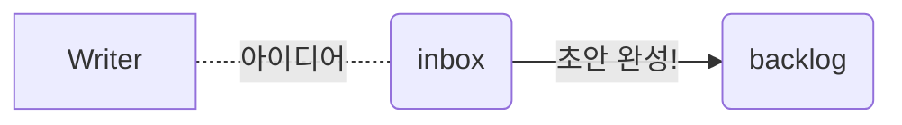
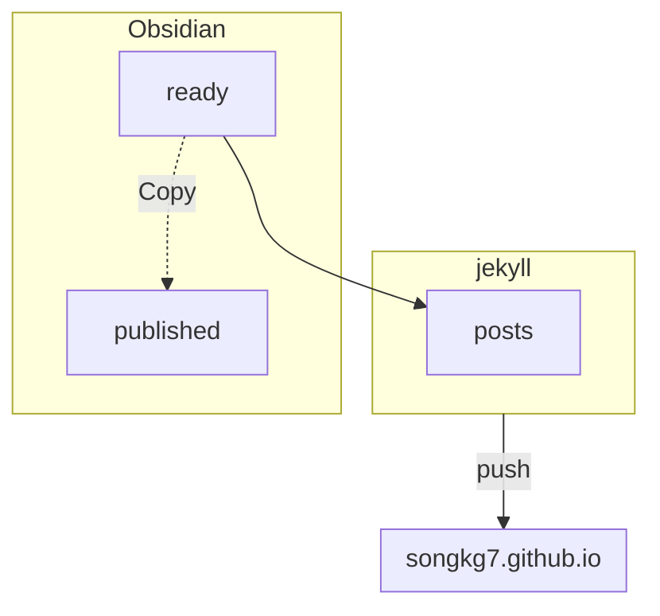

이번 글은 글또에서 진행한 글쓰기 파이프라인에서 영감을 받아, 제 글쓰기 파이프라인에 대해 소개해보려합니다.

## 소재 수집

회사 일을 하면서, 혹은 사이드 프로젝트를 하면서, 혹은 공부를 할 때 등등 여러가지 상황에서 잘 모르는 주제에 대해 접하게 될 때가 있습니다. 저는 그럴 때마다 바로 새로운 노트를 하나 생성합니다. 이 노트에는 잘 몰랐던 키워드를 중심으로 대략적인 소개를 작성합니다.

처음부터 디테일하게 정리하려고 하지는 않습니다. 아직 잘 모르는 주제라서 너무 피곤해지거든요. 더구나 지금 당장은 중요하지 않은 내용일수도 있습니다. 하지만 같은 내용으로 여러 노트를 생성하는 일을 막기 위해 검색이 쉽도록 노트 제목에 신경을 쓰거나 태깅을 해둡니다.

중요한 점은 이 과정이 수시로 진행된다는 점입니다. 

이미 비슷한 주제의 노트가 생성되어 있다면, 약간의 살이 붙을 겁니다. 반복되다보면 어느새 글 하나가 되어 있을 때도 있습니다.

처음 생성되는 노트들은 기본적으로 inbox 에 저장됩니다.

## 학습 및 정리

활용성이 높고 정리하기에 좋은 소재를 찾았다면, 해당 주제에 대해 공부하면서 대략적인 초안을 작성합니다. 이 때는 블로그 목적의 글을 쓰기보다는 스스로의 학습을 목적으로 글을 씁니다. 어디까지나 단순한 메모여서 블로그 포스팅에 대한 부담감을 갖지 않으려고 합니다.

이렇게 작성된 초안은 나름의 평가를 거쳐, 블로그에 올릴만한 주제인가 아닌가를 판단합니다. 저는 다른 커뮤니티 혹은 블로그에서 너무 많이 생산된 주제의 글이라면 나름의 차별화를 위해서 따로 포스팅하지 않는 편입니다.

> [!NOTE]
> 다만 기술적 내용이 아닌, 어떤 문제에 대한 해결과정 소개 등 개인적 경험에 관한 내용은 타 블로그에 중복되는 포스팅이 있더라도 느낀 점이 다를 수 있으므로 작성합니다.

정리된 글은 backlog 디렉토리로 옮깁니다.

> [!TIP] Shoutcut 활용
> Obsidian 에서는 `cmd + p` 를 통해 사용할 수 있는 기능들의 목록을 확인할 수 있습니다. `Move current file to another folder` 를 사용하면 쉽게 노트를 이동시킬 수 있습니다.

## 블로그 글 선정

위 과정을 통해 backlog 에는 어느 정도 완성된 상태의 글들이 쌓여갑니다. 일종의 버퍼처럼, 대략 10개 정도의 글들이 꾸준히 머물고 있는 것 같습니다. 시간이 지나면서 생각이 변하여 더 학습이 필요하다고 판단되는 몇몇 글들은 다시 inbox 로 강등(...)됩니다. 모든 고난과 시련을 거치고 살아남은 글들은 개인적 학습을 위한 글에서 다른 사람에게 보여주기 위한 글로 다듬어 나갑니다.

나름 만족스러운 글이 되었다면 블로그 발행을 위한 디렉토리인, ready 로 옮깁니다.

## 업로드

적당한 시점에 [[develop obsidian plugin|O2]] 를 사용하여 ready 에 있는 파일들을 [[Jekyll]] 로 옮깁니다.

> [!INFO] O2?
> O2 는 Obsidian 을 사용하여 작성한 노트를 블로그 포스팅을 위한 마크다운 포맷으로 변환해주는 옵시디언의 커뮤니티 플러그인입니다.

ready 에 있던 노트들은 Jekyll 프로젝트로 옮겨지기 전 O2 에 의해 published 디렉토리로 복사되고, 백업을 위해 보관됩니다.

이제 작업툴을 옮겨서 [[Obsidian]] 이 아닌 VScode 로 옵니다. Jekyll 의 관리는 이제 에디터의 범위를 벗어나다보니, git 작업이 필요하므로 Obsidian 에서 계속 진행하기엔 애로사항이 있습니다.

대략적인 문맥 및 문법을 다시 한 번 검수해주고, push 하면 블로그 글 발행 과정이 마무리됩니다.

## 퇴고

수시로 살펴보면서 미쳐 찾지 못한 문법적 오류나, 어색한 표현 등을 조금씩 다듬어 줍니다. 이 과정은 최대 몇개월에 걸쳐서 이루어질 때도 있습니다. 그냥 때때로 제 블로그를 살펴보면서 교정하기 때문입니다.

%%이렇게 발행까지 되는 아이디어는 전체 글 중에 아주 일부입니다.%%

이후 내용은 좀 더 디테일한 설명들이므로 마지막으로 이동하셔도 무관합니다.

## 객관화 및 분석

[[Obsidian]] 은 [[Notion]] 과는 다르게 graph view 기능을 제공합니다. 해당 기능을 활용하면 작성한 노트들이 서로 어떻게 연관되어 있는지를 가시화하여 분석에 활용할 수 있습니다. 저는 이 기능을 아주 애용하며, Obsidian 으로 노트를 작성하는 가장 큰 이유 중 하나입니다.

![[obsidian-graph-view-20230417.png]]

_위 그래프에서 밝은 초록색만이 블로그에 발행된 글_

대부분의 노트는 여전히 공부 중인 주제이거나, 블로그 발행 적합성 심사(...)에서 탈락한 글입니다. 이 그래프를 보면 제가 발행한 글들은 어느 정도 안쪽에 위치하며 간선이 많은 것을 볼 수 있는데, 제가 그만큼 관련 내용을 복합적으로 알고 있거나, 다른 지식들과 연관하여 설명할 수 있다는 의미가 됩니다.

저는 블로그 글을 적을 때 제가 상대적으로 잘 아는 내용을 위주로 적는다는 의미로 해석할 수 있겠네요!

가장 안쪽에 있고, 간선도 가장 많지만 블로그 글로 발행하지 않았다는건 위쪽에서 잠깐 언급했듯이 너무 대중적인 주제여서 발행하지 않았을 가능성이 높습니다.

외곽에 간선없이 흩어져있는 노드들은 파편화된 지식들로 아직 깊이있게 알지 못한다는 의미로 해석할 수 있습니다. 이런 노드들은 학습이 진행됨에 따라 안쪽으로 연결되거나 새로운 중심 노드를 형성할 가능성이 있는 것들입니다.

제 블로그를 구성하는 모든 코드 및 설정, 글들은 오픈되어 있습니다.

## 이미지 처리

저는 단순한 마크다운 링크를 통해 이미지를 첨부합니다. 첨부파일이 github repository 에 존재한다면 단순한 마크다운 링크로도 이미지를 포스팅할 수 있습니다.

이해를 돕기 위해 관련 이미지 캡쳐 후 첨부

물론 글을 [[Obsidian]] 에서 쓰고 있으니, 이미지 링크를 마크다운으로 바꿔줄 필요가 있습니다. 이 부분은 제가 직접 개발한 플러그인인 O2 를 사용하여 자동화했습니다. 관련 과정은 이후 다시 설명합니다.

압축률 및 웹 최적화를 위해 가급적 webp 포맷으로 작성, 기존 작성 글들에 첨부된 파일은 github action 을 통해 자동화된 압축처리

## Conclusion

글을 작성할 때 본인의 스타일을 파악하는 것이 중요

저는 글을 시간을 내서 쓰는 경우도 있지만, 대부분은 파편화된 지식들이 하나로 합쳐져가면서 하나의 글이 작성되는 편입니다.

평소 키워드 메모를 하는 습관이 중요. 새로운 키워드를 접하면, 자연스럽게 메모하는 습관이 필요. 의식적으로라도 메모해야하고 메모하는 과정이 아주 빠르게 진행되어야 일하거나 공부하는 과정에서의 의식의 흐름이 메모로 빠져나가지 않음.

때문에 아주 빠르게 동작하는 에디터를 사용하기를 권장.
- 노션에서 옵시디언으로 오게 된 계기
- 노션은 굉장히 편리한 툴이지만, 때때로 느려서 로딩을 기다리다가 메모에 의식의 흐름을 빼앗기던 경우가 종종 있었음
- 만약 본인이 정해진 시간에 정해진 주제로 글을 집중해서 작성하는 것을 선호한다면 노션은 매우 적합한 툴일 것
- 옵시디언은 수시로 메모를 빠르게 작성하기에 좋고 본인이 쓴 글을 분석하는 것에 유리, 협업에는 좋지 않음
