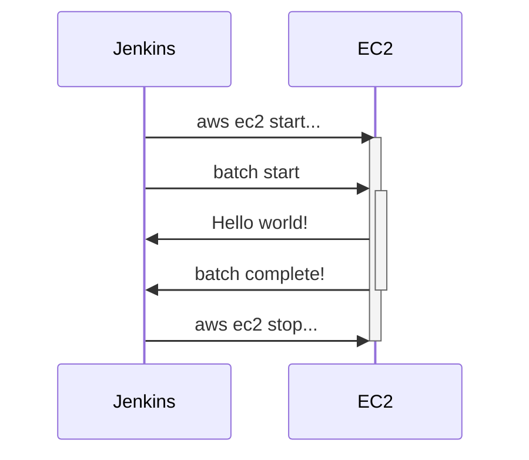

특정 시간, 특정 조건에서만 실행되야하는 배치성 애플리케이션이 존재한다고 할 때 어떤 방식을 통해 리소스 비용을 최적화할 수 있을지 적어봅니다.

## Architecture



이러한 구조로 infra 를 설계한다면 24시간 EC2 리소스를 유지할 필요없이 배치가 실행되기 위해 리소스가 필요해질 때만 비용이 청구되도록 할 수 있습니다.

## Jenkins

[[Jenkins]]

### Jenkins node 설정 및 node 관리 정책

요청이 큐에서 대기할 경우에만 node 를 활성화합니다. 불필요한 error 로그가 남는 것을 최소화할 수 있습니다.

## Event driven develop

### AWS CLI 설치

[[AWS CLI]]를 사용하면 terminal 환경에서도 AWS 의 자원을 관리할 수 있습니다.

아래 명령을 사용하여 현재 사용 중인 인스턴스 목록을 가져올 수 있습니다. 자세한 사용법은 AWS 가이드를 참고합니다.

```bash
aws ec2 describe-instances
```

원하는 리소스의 정보를 확인했다면 target 으로 지정하여 특정 동작을 실행하게 할 수 있습니다.

#### EC2 start

```bash
aws ec2 start-instances --instance-ids {instanceId}
```

#### EC2 stop

```bash
aws ec2 stop-instances --instance-ids {instanceId}
```

### Jenkins 에서의 사용
