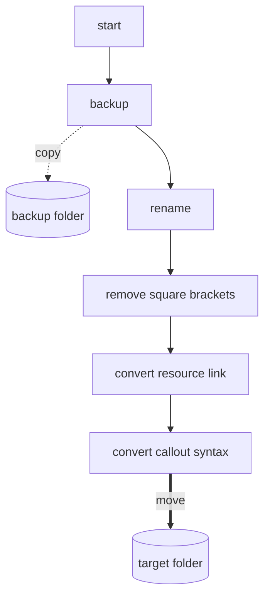
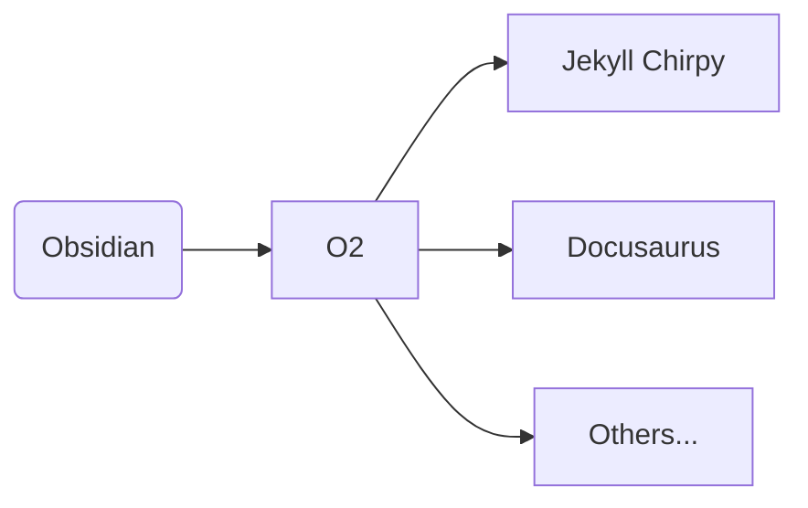

[O2](https://github.com/songkg7/o2) 프로젝트를 좀 더 유연하게 관리할 수 있도록 디자인 패턴을 사용하여 구조를 개선하는 과정을 이야기합니다.

## Problem

[issue](https://github.com/songkg7/o2/issues/50) 를 해결하기 위해 코드를 구현하던 중 그동안 미뤄놨던 문제가 수면 위로 드러나기 시작했습니다.

아래는 기존에 작성해뒀던 마크다운 문법 변환 코드의 구현입니다.

```typescript
export async function convertToChirpy(plugin: O2Plugin) {
    try {
        await backupOriginalNotes(plugin);
        const markdownFiles = await renameMarkdownFile(plugin);
        for (const file of markdownFiles) {
            // remove double square brackets
            const title = file.name.replace('.md', '').replace(/\s/g, '-');
            const contents = removeSquareBrackets(await plugin.app.vault.read(file));
            // change resource link to jekyll link
            const resourceConvertedContents = convertResourceLink(plugin, title, contents);

            // callout
            const result = convertCalloutSyntaxToChirpy(resourceConvertedContents);

            await plugin.app.vault.modify(file, result);
        }

        await moveFilesToChirpy(plugin);
        new Notice('Chirpy conversion complete.');
    } catch (e) {
        console.error(e);
        new Notice('Chirpy conversion failed.');
    }
}
```

[[TypeScript]] 에도 익숙하지 않았고 [[Obsidian 사용 후기|Obsidian]] API library 사용법에도 익숙하지 않은 상태에서 코드를 구현해나가다보니까 전체적인 설계보다 기능의 구현에 급급했습니다.



그나마 기능들을 함수로 분리하여 사용하고는 있었지만 절차지향적으로 작성되어 코드 라인의 순서가 전체 동작에 큰 영향을 주는 상태였습니다. 이 상태에서 기능을 하나 추가하려고 한다면, 정확한 위치에 기능을 삽입해야 전체 변환 과정이 망가지지 않을 것입니다. 그럼 어디가 정확한 위치일까요? 그걸 알기 위해서는 코드를 분석해야 합니다.

즉, 유지보수가 힘든 구조라고 할 수 있습니다. O2 플러그인은 절 위해서 만든 플러그인이기도 하기 때문에 앞으로도 꾸준히 개선이 가능해야하니 더 이상 구조 개선 작업을 미루지 말고, 기능을 추가하기 전 구조 개선 작업부터 진행하기로 했습니다.

## 어떤 구조를 가져야할까?

사실 O2 플러그인을 처음 구현할 때부터 전체적인 구조를 생각해뒀었지만, 타입스크립트에 익숙하지 않은 개발 이슈로(...) 구현하지 못했습니다.

O2 플러그인은 문법 변환 플러그인으로써, Obsidian 의 마크다운 문법을 여러가지로 변환이 가능해야 한다는 명확한 요구사항이 있습니다.



그렇기 때문에, 확장성에 가장 큰 중점을 두고 구조를 설계해야 합니다.

각각의 플랫폼 변환 로직을 모듈화하고, 변환 과정을 추상화하여 일종의 템플릿처럼 구현해두면 다른 플랫폼 문법 지원을 위해 코드를 구현할 때 전체적인 흐름을 재구현해야할 필요없이 개발자는 단지 문법의 변환에만 집중할 수 있을 겁니다.

## Conclusion
